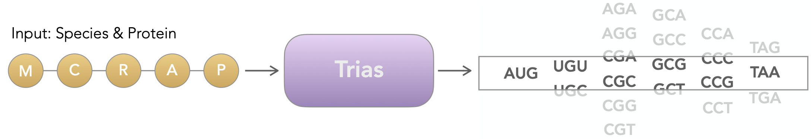

# Trias: an encoder-decoder model for generating synthetic eukaryotic mRNA sequences

Trias is an encoder-decoder language model trained to reverse-translate protein sequences into codon sequences. It learns codon usage patterns from 10 million mRNA coding sequences across 640 vertebrate species, enabling context-aware sequence generation without requiring handcrafted rules.

<p align="center">
  
</p>


## Setup and installation

Trias is developed and tested with **Python 3.8.8**. 

We recommend using `conda`:
```bash
conda create -n trias python=3.8.8
conda activate trias
```

Install dependencies
```bash
git clone https://github.com/lareaulab/Trias.git
cd Trias
pip install -e .
```
Or use `requirements.txt`:
```bash
pip install -r requirements.txt
```


## Reverse Translation

Trias can generate optimized codon sequences from protein input using a pretrained model. You can use any checkpoint hosted on Hugging Face (e.g., lareaulab/Trias) or a local model directory. It supports execution on both CPU and GPU (automatically detected). And we provide both greedy decoding and beam search for flexible output control.

Greedy decoding selects the most likely token at each step, it's faster and deterministic. Beam search explores multiple candidate paths and is better for longer or complex proteins, but also is slower.

CPU example:
```bash
python scripts/reverse_translation.py \
  --model_path lareaulab/Trias \
  --protein_sequence "MTEITAAMVKELRESTGAGMMDCKNALSETQ*" \
  --species "Homo sapiens" \
  --decoding greedy
```

GPU example (with beam search)
```bash
CUDA_VISIBLE_DEVICES=0 python scripts/reverse_translation.py \
  --model_path lareaulab/Trias \
  --protein_sequence "MTEITAAMVKELRESTGAGMMDCKNALSETQ*" \
  --species "Homo sapiens" \
  --decoding beam \
  --beam_width 5
```

## Dataset format

To train Trias, your dataset must include the following columns:
- `protein`: Amino acid sequence, must end with * (stop codon)
- `species_name`: Label identifying the species (e.g., "Homo sapiens")
- `mrna`: Full mRNA sequence
- `codon_start`: 0-based index of the first nucleotide of the coding region in the mrna
- `codon_end`: 0-based index of the last nucleotide of the stop codon

Supported file formats:
- `.parquet`, `.csv`, `.json` (auto-detected)


## Model training

Use the provided training script to launch a run:
```bash
bash scripts/train_trias.sh
```
This launches a full training session using main.py. You can customize:

- Model architecture (hidden_size, n_layer, etc.)
- Training length, batch size, learning rate, etc
- ...


## Citation

If you use Trias, please cite our work:

```bibtex
@article{faizi2025,
  title={A generative language model decodes contextual constraints on codon choice for mRNA design},
  author={Marjan Faizi and Helen Sakharova and Liana F. Lareau},
  journal={bioRxiv},
  year={2025},
  url={https://doi.org/xxxx/xxxx}
}
```
