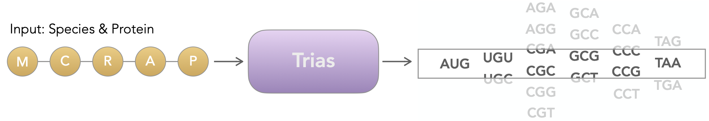

# Trias: an encoder-decoder model for generating synthetic eukaryotic mRNA sequences

Trias is an encoder-decoder language model trained to reverse-translate protein sequences into codon sequences. It learns codon usage patterns from 10 million mRNA coding sequences across 640 vertebrate species, enabling context-aware sequence generation without requiring handcrafted rules.

<p align="center">
  
</p>


## Setup

Trias uses **Python 3.10** and logs training to [Weights & Biases](https://docs.wandb.ai/quickstart/).

```bash
conda create -n trias python=3.10 && conda activate trias
git clone https://github.com/lareaulab/Trias.git && cd Trias
pip install -e .
```

**Benchmarking notebook (optional).** `notebooks/benchmarking.ipynb` also needs:
```bash
pip install CodonTransformer
git clone https://github.com/goodarzilab/cdsFM.git
pip install xformers
```

**Training (optional).** `BartConfig` defaults to FlashAttention-2:
```bash
pip install flash-attn --no-build-isolation
```
For CPU or non-flash inference, pass `attn_implementation="sdpa"` to `from_pretrained`.


## Reverse translation

Generate a codon sequence from a protein with the [`lareaulab/Trias`](https://huggingface.co/lareaulab/Trias) checkpoint. Three decoding modes:

- `greedy` — fast, deterministic.
- `beam` — deterministic, explores `--beam_width` paths.
- `nucleus` — **stochastic**, samples from the top-`--top_p`; output differs every run unless you pass `--seed`.

```bash
python scripts/reverse_translation.py \
  --model_path lareaulab/Trias \
  --protein_sequence "MTEITAAMVKELRESTGAGMMDCKNALSETQ*" \
  --species "Homo sapiens" \
  --decoding greedy
```

For beam: add `--decoding beam --beam_width 5`. For nucleus: add `--decoding nucleus --top_p 0.9` (and `--seed 42` for reproducibility).


## Dataset format

Required columns:
- `protein` — amino acid sequence, must end with `*`
- `species_name` — e.g., `"Homo sapiens"`
- `mrna` — full mRNA sequence
- `codon_start`, `codon_end` — 0-based indices of the CDS in `mrna`

Supported formats: `.parquet`, `.csv`, `.json`.


## Training

```bash
bash scripts/train_trias.sh
```
Edit the script to change model architecture (hidden size, layers, heads) or training hyperparameters (steps, batch size, learning rate).


## Reproducing figures

All figure code lives in [`notebooks/trias_figures.ipynb`](./notebooks/trias_figures.ipynb). All required data is bundled in [`data.zip`](./data.zip):

```bash
unzip data.zip
```

This extracts a `data/` directory with:

| File | Source / use |
|---|---|
| `GTEx_Analysis_2017-06-05_v8_RNASeQCv1.1.9_gene_median_tpm.gct.gz` | tissue expression — [GTEx Portal V8](https://www.gtexportal.org/home/downloads/adult-gtex/bulk_tissue_expression) |
| `codon_table.csv` | sRSCU table per species |
| `human_test_dataset.csv` | held-out test set used for figure metrics |
| `interpro_output.tsv` | InterPro domain annotations |
| `train_data_seq_len.csv` | sequence-length distribution of training data |
| `wandb_training_run.csv` | W&B-exported training curves |
| `benchmarks/moderna/{gfp,luciferase}.csv` | Bicknell et al. 2024, [Cell Reports](https://www.sciencedirect.com/science/article/pii/S2211124724004261) |
| `benchmarks/gemorna/{fluc,nanoluc_leppek}.csv` | benchmarks from the GEMORNA paper |


## Citation

```bibtex
@article{faizi2025,
  title={A generative language model decodes contextual constraints on codon choice for mRNA design},
  author={Marjan Faizi and Helen Sakharova and Liana F. Lareau},
  journal={bioRxiv},
  year={2025},
  url={https://doi.org/10.1101/2025.05.13.653614}
}
```